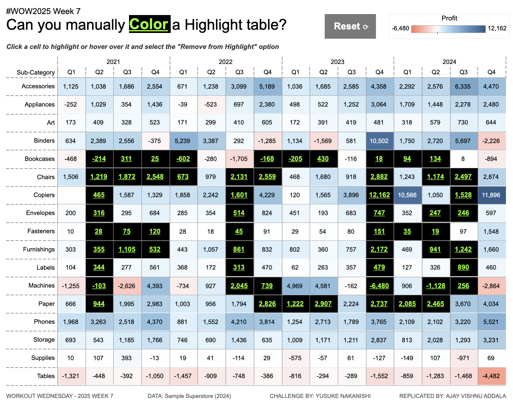

# WOW2025 | Week 7 | Can You Manually Color a Highlight Table?

## Introduction

This repository contains my solution to the **Workout Wednesday 2025 Week 7 Challenge**. The challenge focused on creating a highlight table where users can manually color specific cells by clicking on them, mimicking Excel-like functionality in Tableau.  

Highlight tables add visual emphasis through color, making it easier to identify patterns and trends. This dashboard takes it further by allowing users to interact with specific cells for custom highlighting.

---

## Challenge Requirements

1. **Dashboard Size**: `1000 x 800`.
2. **Sheets**: `1`.
3. **Visualization**: 
   - Highlight table displaying `Sub-Category` by quarterly data for each year.
   - Color a cell by simply clicking on it.
   - Uncolor a cell via a mouse-hover menu.
   - Ensure only the specific cell is highlighted/unhighlighted.
4. **Formatting**: Customizable color schemes.

---

## Features of the Dashboard

- **Interactive Highlighting**: 
  - Click on a cell to highlight it with a custom color.
  - Uncolor cells using an intuitive mouse-hover menu.
- **Customizable Appearance**: 
  - Flexible color schemes and design to align with user preferences.
- **User-Friendly Interface**: 
  - Clean and responsive layout for seamless interaction.

---

## Tableau Public Link

You can view the published dashboard on Tableau Public here: [WOW2025 Week 7 Dashboard](https://public.tableau.com/views/ManuallyColoraHighlightTableWOW2025W7/WOW2025W7?:language=en-US&:sid=&:redirect=auth&:display_count=n&:origin=viz_share_link).

---

## Feedback

Feel free to raise an issue or provide feedback. Your input helps improve this solution!

---

## Attribution

This dashboard was created as part of the **Workout Wednesday 2025** challenges. Thanks to **Yusuke Nakanishi** for designing this week’s challenge. 

For more details, visit the [Workout Wednesday website](https://www.workout-wednesday.com).

## License

This project is licensed under the MIT License.
